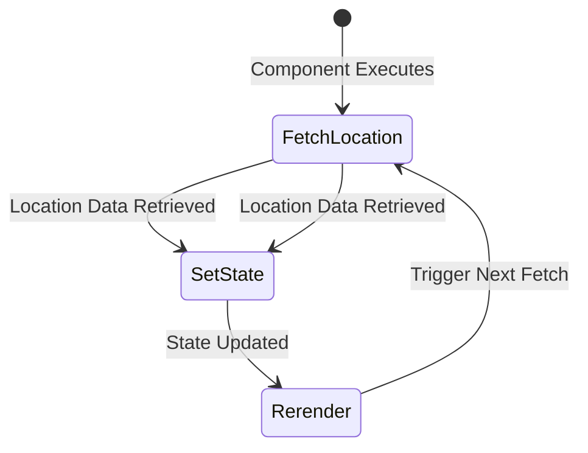

### Exploring `useEffect()` hook and side effects management 

## Topics - Keeping UI Synchronized
1. Side Effects 
2. `useEffect()` hook
3. Effects & Dependencies 
4. When to not use `useEffect()` hook

---

## Getting started: 
- Download local starting project 
- npm install 
- nom run dev 

---

## Local Starting Project: 
- Couple components 
- Utilizes State, Refs and `useImperativeHandle()`
- `data.js` - random data for outpputting the place cards 
- `loc.js` - location calculation logic

---

## As a heads up
Loc.js has a function where we will begin exploring the new concepts. 
```js
sortPlacesByDistance
```
--- 

#### What are Side Effects 🤔!?!
--> They are tasks that need to be executed that don't impact the current render cycle 
--> Something needs to be done but it should not directly on instantly impact the current render cycle

---

## Example: 
- In the current app, we have the list of places and we'd like to sort the places by distance to the user of the website 
- That's why we have a `loc` file to calculate that distance 
- We export a function, `sortPlacesByDistance` which takes an array of places and sorts it by distance
    - relative to the user's location 

# Problem #1
We need user's location. 
    - In theory that's not difficult. We can use a built in browser feature for that 
    - We also need this ASAP so that we can start running algorithms on it 
    - App.jsx is our "entry point" aka the root component. 
    - Makes sense to derive the user location here 

Here is the method: `navigator.geolocation.getCurrentPosition();`
    - This will ask the user for permission before retreiving the user's location 
    - This however takes time to fetch the location 
    - Therefore, `getCurrentPosition` give us a callBack function 
    - It runs once the location has been fetched. Could be milli seconds or couple seconds. 

```jsx
navigator.geolocation.getCurrentPosition(()=>{

})
```

Here is where we call the `sortPlacesByDistance`
    - We pass `AVAILABLE_PLACES`, now we need the longitude and latitude coordinates
    - The browser provides this through a position object that is passed to the callBack function.
    - We can use that to access the nested `coords` object and then there `latitude` and `longitude`
    - This will return the sorted array based on the location which we'll store in a const

```jsx
navigator.geolocation.getCurrentPosition((position)=>{
    const sortedPlaces = sortPlacesByDistance(
        AVAILABLE_PLACES,
        position.coords.latitude, 
        position.coords.longitude
    )
})
```
# Problem #2 - All this is a Side Effect 
We need the location BUT 
    - It's not directly related to the Component's main objective 
    - App's main goal is to return renderable JSX code 
    - That code is not related to that 
    - Things like eventListeners, settingState...
        - But fetching a user's location has nothing to do with the UI renders 
        - Also, that code doesn't finish instantly. It will be called sometimes in the future maybe after the App has finished execution 

# That's why it's a side effect!
It's not necessarily bad 
    - There will be a problem here 
    - Now that we have sortedPlaces we want to use it 
    - In the `Places` component, we want to pass the `sortedPlaces` 
    - And the `sortedPlaces` array isn't available right away as it takes some time to retreive that user data 
    - So the first Render cycle of the `App` component will be finished at the point of time where we have user location

---

## Let's Fix it
We need state!
    - `const [availablePlaces, setAvailablePlaces] = useState([]);`
    - Start with empty array and we set the state to sortedplaces 
        - ONCE WE HAVE THEM 
    - So after we have fetched the user's location 
    - This `setAvailablePlaces` re-renders the Component and the state will be updated with the sortedPlaces 
    - Then we can pass this to the `PLaces` Component 

```jsx
const [availablePlaces, setAvailablePlaces] = useState([]);
navigator.geolocation.getCurrentPosition((position)=>{
    const sortedPlaces = sortPlacesByDistance(
        AVAILABLE_PLACES,
        position.coords.latitude, 
        position.coords.longitude
    )
    setAvailablePlaces(sortedPlaces);
});
```
 ## Wrong! ➡️ We run into a infinite loop 
Looks like a good solution but it has a flaw 
    - Why? 
        * We are updating a state 
        * Calling such a state updating function tells react to re-execute the component 
        * If the component function executes again, we fetch the user's location again 
        * Then we set the state again -> re-render -> fetch location -> set state -> re-render -> fetch location




---

## We got a Infinite Loop 
That's the problem of side effect and why we use `useEffect()` hook

---

### SUMMARY

`App renders `→ but we don’t have the user’s location yet.
`We call getCurrentPosition()` → this takes time (waiting for user permission + retrieving GPS data).
`React doesn’t wait! `→ It moves on and completes rendering without the location.
`UI gets built with incomplete data` → because sortPlacesByDistance() needs location, but we don’t have it yet.
Later, `the location arrives` 🎉 but… `React` doesn’t know it should update the UI!

### Why is this a Problem?
`React` doesn’t track local variables like `sortedPlaces`.

So even though we now have the user’s location, React won’t re-render to show the sorted list.

We need to tell `React`:

"Hey, `React`! The location has arrived!"
"Update the state so we can re-render with the sorted places!"

How Do We Fix This?
✅ Use useState() → Store `sortedPlaces` in state so `React` can track changes.
✅ Use useEffect() → Run `getCurrentPosition()` after the first render to fetch location.
✅ Update state when location arrives → `React` sees the change and triggers a re-render.
    
